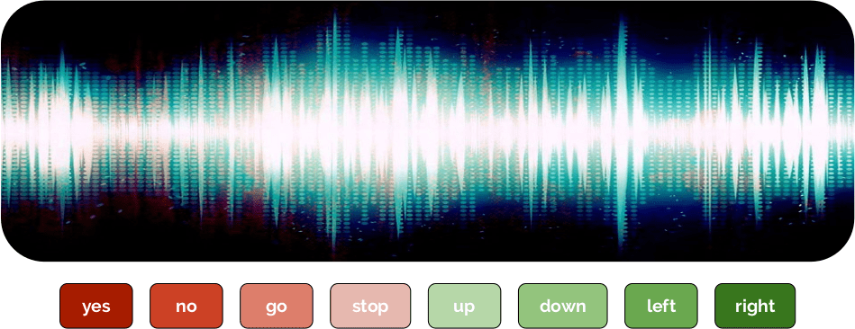

DEEP Open Catalogue: Speech to Text
====================================

[](https://jenkins.indigo-datacloud.eu/job/Pipeline-as-code/job/DEEP-OC-org/job/speech-to-text-tf/job/master/)


**Author:** [Lara Lloret Iglesias](https://github.com/laramaktub) (CSIC)

**Project:** This work is part of the [DEEP Hybrid-DataCloud](https://deep-hybrid-datacloud.eu/) project that has
received funding from the European Union’s Horizon 2020 research and innovation programme under grant agreement No 777435.

This is a plug-and-play tool to train and evaluate a speech to text tool using deep neural networks.

<p align="center">  </p>


## Installing this module

### Local installation

> **Requirements**
>
> This project has been tested in Ubuntu 18.04 with Python 3.6.5. Further package requirements are described in the
> `requirements.txt` file.
> - It is a requirement to have [Tensorflow>=1.14.0 installed](https://www.tensorflow.org/install/pip) (either in gpu 
> or cpu mode). This is not listed in the `requirements.txt` as it [breaks GPU support](https://github.com/tensorflow/tensorflow/issues/7166). 

To start using this framework clone the repo:

```bash
git clone https://github.com/deephdc/speech-to-text-tf
cd speech-to-text-tf
pip install -e .
```
now run DEEPaaS:
```
deepaas-run --listen-ip 0.0.0.0
```
and open http://0.0.0.0:5000/ui and look for the methods belonging to the `speechclas` module.

### Docker installation

We have also prepared a ready-to-use [Docker container](https://github.com/deephdc/DEEP-OC-speech-to-text-tf) to
run this module. To run it:

```bash
docker search deephdc
docker run -ti -p 5000:5000 -p 6006:6006 -p 8888:8888 deephdc/deep-oc-speech-to-text-tf
```

Now open http://0.0.0.0:5000/ui and look for the methods belonging to the `speechclas` module.


## Train a speech classifier

### 1. Data preprocessing

The first step to train your speech to text neural network is to put your `.wav` files into folders.
The name of each folder should correspond to the label for those particular audios.  
Put your audios in the`./data/dataset_files` folder.

Alternatively you provide an URL with the location of the `tar.gz` containing all the folders with the training files.
This will automatically download the `tar.gz`, read the labels and get everything ready to start the training. 


### 2. Train the classifier

Go to http://0.0.0.0:5000/ui and look for the ``TRAIN`` POST method. Click on 'Try it out', change whatever training args
you want and click 'Execute'. The training will be launched and you will be able to follow its status by executing the 
``TRAIN`` GET method which will also give a history of all trainings previously executed.

If the module has some sort of training monitoring configured (like Tensorboard) you will be able to follow it at 
http://0.0.0.0:6006.

After training you can check training statistics and check the logs where you will be able to find the standard output
during the training together with the confusion matrix after the training was finished.

Since usually this type of models are used in mobile phone application, the training generates the model in .pb format
allowing to use it easily to perform inference from a mobile phone app.


## Test the classifier

> **Note**
>
> This module does not come with a pretrained classifier so you will have to train a classifier first before being able to 
> use the testing methods.

Go to http://0.0.0.0:5000/ui and look for the `PREDICT` POST method. Click on 'Try it out', change whatever test args
you want and click 'Execute'. You can **either** supply a:

* a `data` argument with a path pointing to a `wav` file.

OR
* a `url` argument with an URL pointing to a `wav` file.
  Here is an [example](https://file-examples.com/wp-content/uploads/2017/11/file_example_WAV_1MG.wav) of such
  an url that you can use for testing purposes.

## Acknowledgments

The network architecture is based in one of the [tutorials](https://www.tensorflow.org/tutorials/sequences/audio_recognition)
provided by Tensorflow. The architecture used in this tutorial is based on some described in the paper
[Convolutional Neural Networks for Small-footprint Keyword Spotting](https://static.googleusercontent.com/media/research.google.com/es//pubs/archive/43969.pdf).
It was chosen because it's comparatively simple, quick to train, and easy to understand, rather than being state of the
art. There are lots of different approaches to building neural network models to work with audio, including recurrent
networks or dilated (atrous) convolutions. This tutorial is based on the kind of convolutional network that will feel
very familiar to anyone who's worked with image recognition. That may seem surprising at first though, since audio is
inherently a one-dimensional continuous signal across time, not a 2D spatial problem. We define a window of time we
believe our spoken words should fit into, and converting the audio signal in that window into an image. This is done
by grouping the incoming audio samples into short segments, just a few milliseconds long, and calculating the strength
of the frequencies across a set of bands. Each set of frequency strengths from a segment is treated as a vector of numbers,
and those vectors are arranged in time order to form a two-dimensional array. This array of values can then be treated
like a single-channel image, and is known as a spectrogram. An example of what one of these spectrograms looks like:

<p align="center">  </p>
